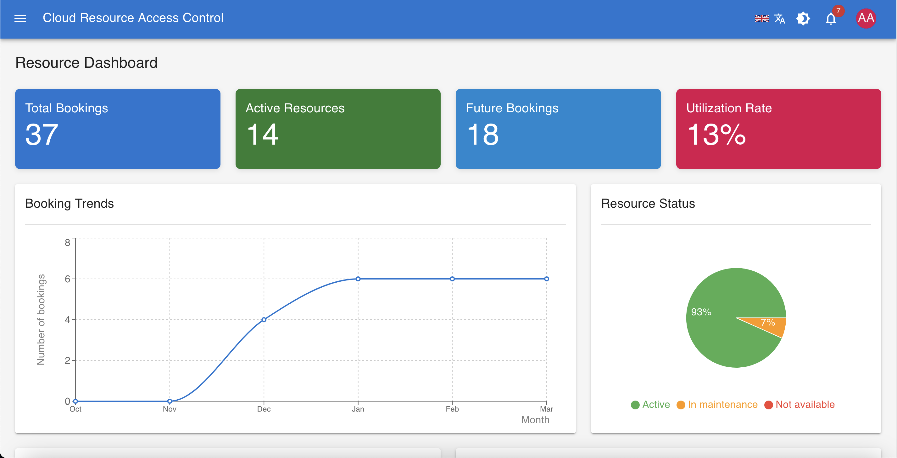
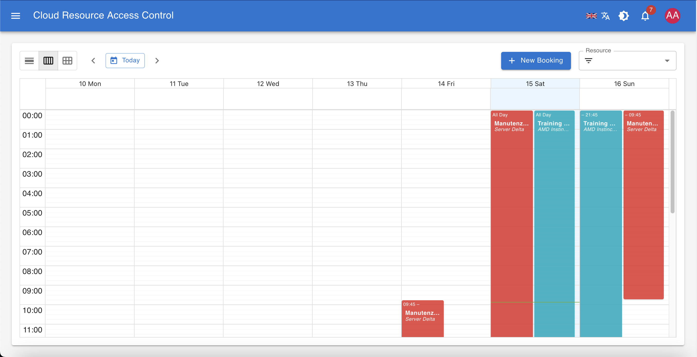

# Cloud Resource Management System 🚀

[](https://reactjs.org/)
[](https://mui.com/)
[](https://www.i18next.com/)
[](LICENSE)
[](package.json)

A comprehensive cloud resource management application built with React and Material UI, allowing users to manage resource bookings across an organization.

> **Important**: This repository is a sub-module of the main repository [cloud-resource-reservation](https://github.com/giovannimirarchi420/cloud-resource-reservation), which contains the complete project including backend services, database and Keycloak initialization scripts, and Docker configuration.




> 📸 **More screenshots available in the `/img` directory.**

## 🌐 Live Demo

**Demo URL**: [https://204.216.215.139/](https://204.216.215.139/)

**Login Credentials**:
- Username: `admin`
- Password: `password`

## ✨ Features

- **📅 Resource Booking**: Schedule and manage resource reservations with an intuitive calendar interface
- **📦 Resource Management**: Add, edit, and maintain resources and resource types
- **👥 User Management**: Manage users with different permission levels (admins and regular users)
- **📊 Dashboard**: Visualize resource usage with interactive charts and statistics
- **🔔 Notification System**: Real-time notification center for booking changes and system events
- **🌍 Multi-language Support**: Full internationalization for English and Italian
- **📱 Responsive Design**: Works seamlessly on desktop and mobile devices
- **🌓 Dark Mode**: Light or Dark Mode support

## 🛠️ Technology Stack

- **Frontend**: React 19.0.0, Material UI 6.4.7
- **State Management**: React Context API
- **Authentication**: Keycloak integration
- **Visualization**: Recharts for data visualization
- **Calendar**: React Big Calendar for booking interface
- **Internationalization**: i18next for multi-language support

## 🚀 Getting Started

### Prerequisites

- Node.js (v16.x or higher)
- npm or yarn

> **Recommended**: For a complete environment including backend, database, and authentication services, clone the main repository [cloud-resource-reservation](https://github.com/giovannimirarchi420/cloud-resource-reservation) which includes this frontend as a sub-module along with Docker Compose configuration.

### Installation

1. Clone the repository:
   ```bash
   git clone https://github.com/giovannimirarchi420/reservation-fe.git
   cd reservation-fe
   ```

2. Install dependencies:
   ```bash
   npm install
   # or
   yarn install
   ```

3. Configure environment variables:
   Create a `.env` file in the root directory with:
   ```
   REACT_APP_API_URL=http://localhost:8080/api
   REACT_APP_KEYCLOAK_URL=http://localhost:8180
   REACT_APP_KEYCLOAK_REALM=resource-management
   REACT_APP_KEYCLOAK_CLIENT_ID=resource-management-app
   ```

4. Start the development server:
   ```bash
   npm start
   # or
   yarn start
   ```

## 📂 Project Structure

```
/
├── public/                       # Static assets
│   ├── index.html                # Main HTML file
│
├── src/                          # Source code
│   ├── components/               # UI components
│   │   ├── Admin/                # Admin panel components
│   │   ├── Booking/              # Booking components
│   │   ├── Common/               # Shared components
│   │   ├── Dashboard/            # Dashboard components
│   │   ├── LanguageSelector/     # Language selection UI
│   │   ├── Layout/               # Layout components
│   │   ├── Notifications/        # Notification components
│   │   ├── Profile/              # User profile management
│   │   ├── Resources/            # Resource components
│   │   ├── ThemeSwitcher/        # Theme toggling UI
│   │   └── Users/                # User management components
│   ├── config/                   # Application configuration
│   ├── context/                  # React context providers
│   ├── hooks/                    # Custom React hooks
│   ├── i18n/                     # Internationalization
│   │   └── locales/              # Language files (en, it)
│   ├── services/                 # API services
│   │   ├── apiCore.js            # Core API functionality
│   │   ├── authService.js        # Authentication service
│   │   ├── bookingService.js     # Booking API
│   │   ├── notificationService.js # Notification API
│   │   ├── resourceService.js    # Resource API
│   │   └── userService.js        # User API
│   ├── styles/                   # CSS styles
│   ├── theme/                    # Theme configuration
│   ├── utils/                    # Utility functions
│   ├── App.jsx                   # Main App component
│   └── index.jsx                 # Application entry point
```

## 🌟 Main Features

### 📅 Resource Booking Calendar

- View resources and existing bookings
- Create new bookings with conflict detection
- Edit or delete existing bookings
- Filter resources by type or status

### ⚙️ Admin Panel

- Resource management (add, edit, delete)
- Resource type configuration 
- User management with role-based access
- System settings

### 📊 Dashboard

- Resource utilization rates
- Booking trends over time
- Resource status overview
- Upcoming reservations

## 🚀 Deployment

### Building for Production

```bash
npm run build
# or
yarn build
```

The build artifacts will be stored in the `build/` directory.

### Deployment Options

- Static hosting services (Netlify, Vercel, etc.)
- AWS S3 + CloudFront
- Docker container (Nginx-based)
- Traditional web servers (Apache, Nginx)

### Docker Deployment

The repo includes a Dockerfile and build script for containerization:

```bash
# Build and push Docker image
./build-and-push.sh
```

### Full Stack Deployment

For a complete deployment with all services:

1. Clone the main repository:
   ```bash
   git clone https://github.com/giovannimirarchi420/cloud-resource-reservation.git
   cd cloud-resource-reservation
   ```

2. Initialize and update submodules:
   ```bash
   git submodule init
   git submodule update
   ```

3. Use Docker Compose to start all services:
   ```bash
   docker-compose up -d
   ```

This will set up the complete environment including frontend, backend API, database, and Keycloak authentication server.

## 🔒 Authentication and Authorization

The application uses Keycloak for authentication and role-based access control:
- **👑 Administrators**: Full access to all features
- **👤 Users**: Can view resources and manage their own bookings

## 🤝 Contributing

1. Fork the repository
2. Create your feature branch (`git checkout -b feature/amazing-feature`)
3. Commit your changes (`git commit -m 'Add some amazing feature'`)
4. Push to the branch (`git push origin feature/amazing-feature`)
5. Open a Pull Request

## 📄 License

This project is licensed under the MIT License - see the LICENSE file for details.